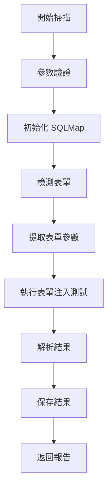

# SQLMap 功能設計文檔

## 1. 整體架構

### 1.1 核心組件
- SQLMap 掃描器（SQLMapScanner）
- 結果解析器（ResultParser）
- 數據庫模型（SQLMapResult）
- API 接口（SQLMapAPI）
- 表單處理器（FormProcessor）

### 1.2 工作流程


## 2. 功能模塊

### 2.1 掃描配置
- 目標 URL
- 掃描級別（1-5）
- 線程數
- 超時設置
- 自定義 Headers
- Cookie 處理
- 表單處理選項：
  - 自動檢測表單
  - 表單參數提取
  - 表單提交方法（GET/POST）
  - 數據類型識別

### 2.2 掃描類型
- GET/POST/PUT/DELETE/PATCH/HEAD/OPTIONS/TRACE/CONNECT 參數
- HTTP Headers
- Cookie 值
- 表單字段注入：
  - 登錄表單
  - 搜索表單
  - 數據提交表單
  - 文件上傳表單
- 基於時間的盲注
- 基於布爾的盲注
- 基於錯誤的注入
- UNION 查詢注入
=============================================交給sqlmap===================================
### 2.3 表單處理
- 表單檢測：
  - 自動識別表單結構
  - 提取表單字段
  - 分析字段類型
  - 識別必填項
- 參數處理：
  - 智能填充默認值
  - 保持必填字段有效性
  - 處理特殊字段（驗證碼等）
- 提交模擬：
  - 模擬正常用戶行為
  - 處理重定向
  - 維護會話狀態
  - 處理 CSRF 令牌
=============================================8191端口幫助flaresolverr===================================
### 2.4 結果處理
- 漏洞類型識別
- 注入點定位
- Payload 記錄
- 數據提取結果
- 表單相關結果：
  - 易受攻擊的表單字段
  - 成功的注入向量
  - 表單提交方法
  - 繞過保護機制

## 3. 數據模型

### 3.1 SQLMapResult
```python
class SQLMapResult(db.Model):
    id = db.Column(db.Integer, primary_key=True)
    target_id = db.Column(db.Integer, db.ForeignKey('target.id'))
    scan_time = db.Column(db.DateTime, default=datetime.utcnow)
    vulnerability_type = db.Column(db.String(50))
    injection_point = db.Column(db.String(255))
    payload = db.Column(db.Text)
    dbms = db.Column(db.String(50))
    os = db.Column(db.String(50))
    risk_level = db.Column(db.Integer)
    form_method = db.Column(db.String(10))  # GET/POST
    form_action = db.Column(db.String(255))
    form_fields = db.Column(db.JSON)  # 表單字段信息
    vulnerable_fields = db.Column(db.JSON)  # 易受攻擊的字段
    details = db.Column(db.JSON)
```

## 4. API 接口

### 4.1 掃描接口
```
POST /api/v1/sqlmap/scan
請求參數：
{
    "target_id": int,
    "url": string,
    "level": int,
    "risk": int,
    "threads": int,
    "timeout": int,
    "headers": object,
    "cookies": string,
    "forms": {
        "detect": boolean,
        "fields": array,
        "method": string,
        "action": string,
        "token": string
    }
}
```

### 4.2 結果查詢接口
```
GET /api/v1/sqlmap/result/{scan_id}
返回數據：
{
    "status": string,
    "progress": int,
    "results": array,
    "details": object
}
```

## 5. 安全考慮

### 5.1 掃描限制
- 僅允許授權用戶訪問
- 限制掃描頻率
- 阻止內網掃描
- 設置超時限制

### 5.2 結果保護
- 加密敏感信息
- 限制訪問權限
- 日誌審計

## 6. 錯誤處理

### 6.1 常見錯誤
- 連接超時
- 目標不可達
- 權限不足
- 資源耗盡

### 6.2 錯誤響應
```python
{
    "status": "error",
    "code": int,
    "message": string,
    "details": object
}
```

## 7. 性能優化

### 7.1 掃描優化
- 多線程支持
- 緩存機制
- 智能任務調度
- 資源限制

### 7.2 存儲優化
- 數據庫索引
- 結果壓縮
- 定期清理 